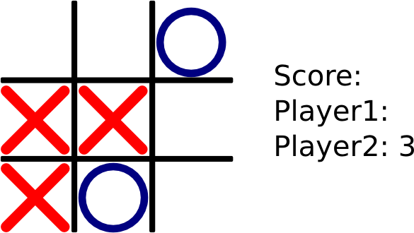

#Design Report

This report contains the intended structure of the Bonnie Tyler Fan Club's web-based TicTacToe implementation. The goal of this report is to provide a brief introduction of its purpose and functionalities as well as establish some of the structural rules the code present here will go by. Our TicTacToe application will have a web-based interaction where pair of human players will be able to compete with each other and keep score of their matches. Human and AI matches will also be a possibility. To keep such scores, the implementation of a database was necessary. ##Currently, this version does not support an AI-controlled player. ALSO CHECK THE SQL STUFF AND IF THE AI PLAYER WAS INDEED ADDED

##Prototype
This is a schematic of our intended graphical interface. Since a TicTacToe requires very simple graphical design, the same graphical assets shown here will also serve as the actual working  interface for the software. Something shinier is in the horizon for later versions, hopefully.

##Coding rules

###General

* Thorough and descriptive comments are MANDATORY, particularly in the more complex logical snippets of the code. This is extremely important for other people to be able to understand (both for our own programming team as well as other developers). 
* All functions should have concise comments describing what they do above them and all conditional logic should be explained.

###Java

* Allman style as the indenting convention.
* Camel Casing as a naming convention. (lower Camel Casing is used for parameters and attributes and upper Camel Casing for most identifiers)
* Constants will be written in all capitals
* Names should be chosen according to semantic meaning rather than presentation.
* Place the comment on a separate line, not at the end of a line of code.
* Add at least one blank line between method definitions and property definitions.
* Write only one declaration and one statement per line.

####Sample code

	//Check if a number is 5 or 6 and if so return it, else return 0
	public int foo(int argument)
	{
		//If our argument is either 5 or 6 return our value
		if(argument == 5 || argument == 6)
		{
			return argument;
		}
		//If not we aren't intererested in the number and just return 0
		else
		{
			return 0;
		}
	}

###HTML

* There must be a correct DOCTYPE at the start of the file.
* All tags must be properly nested.
* Names should be chosen according to semantic meaning rather than presentation.
* Usage of clear and precise names for IDs and classes.
* Comments should be done judiciously.
* All tags and attribute names will be in lower case.
* All tags are properly closed, and empty elements have a trailing slash (<strong></strong>, and ).
* All attributes are properly quoted ( instead of ).
* The unit of indentation is four spaces.

####Sample code
	<!DOCTYPE html>
	<html lang="en" xmlns="http://www.w3.org/1999/xhtml">
		<head>
			<meta charset="utf-8" />
			<title>Title</title>
			<link rel="stylesheet" type="text/css" href="style.css">
			
		</head>
		<body>
			<!--This is a fairly useless web page-->
			
This is a paragraph

		</body>
	</html>

###CSS

# Use an external CSS file.
# The unit of indentation is four spaces.
# Use points for text size.
# Use pixels for all other sizes.
# Use hexadecimal notation for color (except when the use of the alpha channel is required).

####Sample code

<!-- In the HTML document: -->
<head>
    <link rel="stylesheet" type="text/css" href="test.css" />
</head>

/* In the CSS file: */
selector
{
    font-size: 12pt;
    property0: 30px;
    property1: value;
    property2: anotherValue;
    background-color: #00ff00;
}

###Javascript
* The unit of indentation is four spaces.
* Camel Casing as a naming convention (lower Camel Casing for variables and functions, upper Camel Casing for behavior implementation structures).
* Names should be chosen according to semantic meaning rather than presentation.
* Avoid lines longer than 80 characters.
* All functions and variables should be declared before used.
* Comments should be done judiciously, well written and clear.
* Use of global variables should be minimized.
* Implied global variables should never be used.
* Unary special-character operators (e.g., ++, --) must not have space next to their operand.
* Do not use $ (dollar sign) or \(backslash) in names.
* Any comma and semicolon must not have preceding space.
* Blank spaces should be used to improve readability.

####Sample code
// A button clicked will call for
// this function to copy any selected text
function copyIt(theField)
{
    var selectedText = document.selection;
    // If the selection is text, copy content
    if (selectedText.type == 'Text') {
        var newRange;
        newRange = selectedText.createRange();
        theField.focus();
        theField.value = newRange.text;
    } else 
     {
        alert('Select a text in the page and then press this to copy it.');
     }
}

##PostgresSQL
* The unit of indentation is four spaces. Such should be used in multi-lined queries.
* Comments should be done judiciously, well written and clear.
* Blank spaces should be used to improve readability.
* Capitalize reserved words.
* Table names should be singular 

####Sample code

SELECT T1.col1, T1.col2, T2.col3
FROM table1 T1
     INNER JOIN ON Table2 T2 ON T1.ID = T2.ID
WHERE T1.col1 = 'xxx'
AND T2.Col3 = 'yyy';

##Class diagram
We will be using five classes (written in Java) for this program. Their diagram can be seen below.

###Class description
The following is a short description of the role of each of our classes.

* TicTacToe: Contains the main logic of our program. Business layer.

* Board: Represents the board a game of TicTacToe is played on, contains operations for altering the matrix'  outlook.

* Player(interface): Represents a player that plays the game. Purely virtual.

* HumanPlayer: A human player, takes in human input. Inherits from the Player function.

* ComputerPlayer: A computer player
